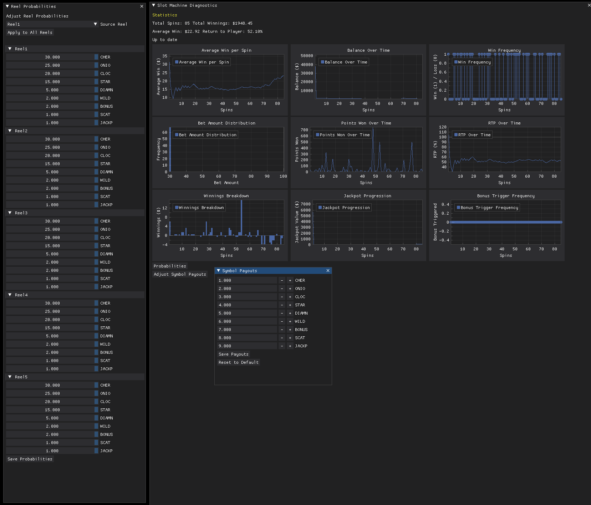

# Slot Machine Algorithm Project

  

This project implements a slot machine reel algorithm without a graphical user interface. It includes supportive diagnostics tools to manipulate the algorithm's probabilities. In theory, this algorithm can be integrated with an actual slots game, as it produces reel results that can be exported to other applications, such as a GUI. This allows for the possibility of a purely graphical slots game that derives its reel choices from this algorithm, as it performs calculations that can be outputted in various formats.

## Components

### 1. Slot Machine Algorithm (reelAlgo.py)

  

This script implements the core logic of the slot machine game. Key features include:

- 🟢 Reel spinning mechanism with configurable symbol probabilities
- 🟢 Multiple paylines for win calculation
- 🟢 Bonus game functionality with adjustable trigger frequency
- 🟢 Currency and token management
- 🟢 Jackpot system integration
- 🟢 Logging of game results for analysis
- 🟢 Implemented house edge for long-term game balance
- 🟢 Maximum bet limit to prevent excessive wagering
- 🟢 Enhanced win calculation considering bet amount and house edge
- 🟢 Improved random selection of symbols based on configured probabilities
- 🟢 Removed inaccurate in-game RTP calculation for more realistic gameplay
- 🟢 Updated main menu for streamlined user interaction

The script provides a text-based interface for playing the game, allowing users to place bets, spin the reels, and participate in bonus rounds. It now offers a more balanced and realistic slot machine experience with improved game economics.

### 2. Diagnostics Tool (diagnostics_tool.py)

  

This tool provides real-time analysis, visualization of the slot machine's performance, and control over game probabilities and payouts. Features include:

- 🟢 Automatic updates based on changes in the log file
- 🟢 Display of key statistics (total spins, winnings, average win, RTP)
- 🟢 Multiple charts for data visualization:
  - 🟢 Average Win per Spin
  - 🟢 Balance Over Time
  - 🟢 Bet Amount Distribution
  - 🟢 Points Won Over Time
  - 🟢 Winnings Breakdown
  - 🟢 Jackpot Progression
  - 🟢 Win Frequency
  - 🟢 RTP Over Time
  - 🟢 Bonus Trigger Frequency
- 🟢 Probability Control:
  - 🟢 View and adjust symbol probabilities for each reel
  - 🟢 Apply probability settings from one reel to all reels for quick configuration
  - 🟢 Save updated probabilities to directly affect the game's behavior
- 🟢 Payout Control:
  - 🟢 View and adjust symbol payouts
  - 🟢 Modify payouts for individual symbols or combinations
  - 🟢 Save updated payouts to immediately impact game economics

The tool uses DearPyGui for creating an interactive graphical interface with multiple charts arranged in a grid layout and intuitive controls for probability and payout adjustments.

### 3. Jackpot Manager (jackpot_manager.py)

This module manages the jackpot functionality for the slot machine game. It handles:

- 🟢 Initializing and loading the jackpot value from a file
- 🟢 Incrementing the jackpot based on bets placed
- 🟢 Saving the updated jackpot value
- 🟢 Checking for jackpot wins
- 🟢 Resetting the jackpot when necessary

The jackpot value is stored in a JSON file and increases by a configurable percentage of each bet placed.

### Advanced Random Number Generator (advanced_rng.py)

This module implements a sophisticated random number generator specifically designed for the slot machine simulation. It uses the Mersenne Twister algorithm with enhanced seeding to provide high-quality randomness while maintaining the desired probability distributions for each reel.

Key features include:

- **SlotMachineRNG Class**: Encapsulates the random number generation logic for the slot machine.
  - Uses Python's implementation of the Mersenne Twister algorithm.
  - Implements a robust seeding mechanism using multiple entropy sources.

- **Enhanced Seeding**: 
  - Combines current time (nanosecond precision), process ID, and random bytes from the operating system.
  - Uses SHA-256 hashing to create a 256-bit seed, ensuring high-quality initial randomness.

- **Configurable Reel Generation**: 
  - Generates spin results based on the reel configuration provided in `slot_config.json`.
  - Maintains accurate symbol probabilities as defined in the configuration.

- **Symbol Mapping**: 
  - Implements a weighted random selection algorithm to map random numbers to symbols based on their defined probabilities.

- **Distribution Testing**: 
  - Includes a `test_distribution` function to verify the accuracy of symbol probabilities over a large number of spins.

This advanced RNG system ensures that the slot machine simulation maintains fairness and unpredictability while adhering to the configured probabilities for each symbol on each reel. It provides a solid foundation for realistic and statistically accurate slot machine behavior.

## Usage

1. Run `reelAlgo.py` to play the slot machine game.
2. Run `diagnostics_tool.py` to view real-time performance analytics and adjust game probabilities.

## Dependencies

- 🟢 Python 3.x
- 🟢 NumPy
- 🟢 DearPyGui

## Files

- `reelAlgo.py`: Main slot machine game logic
- `diagnostics_tool.py`: Performance analysis, visualization tool, and probability control
- `jackpot_manager.py`: Jackpot management module
- `logs.json`: Game result logs (generated by reelAlgo.py)
- `jackpot.json`: Stores the current jackpot value
- `slot_config.json`: Stores reel probabilities and other game configuration settings

## Future Improvements

- 🟢 Implement a graphical user interface for the slot machine game
- 🟢 Enhance the diagnostics tool with more advanced analytics
- 🟢 Add more customization options for the slot machine configuration
- 🟢 Implement real-time synchronization between probability changes and the running game